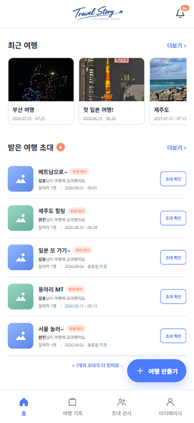
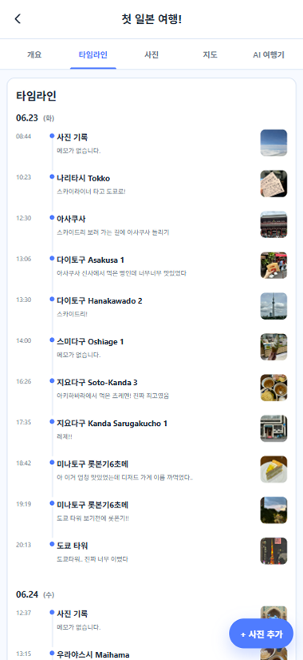
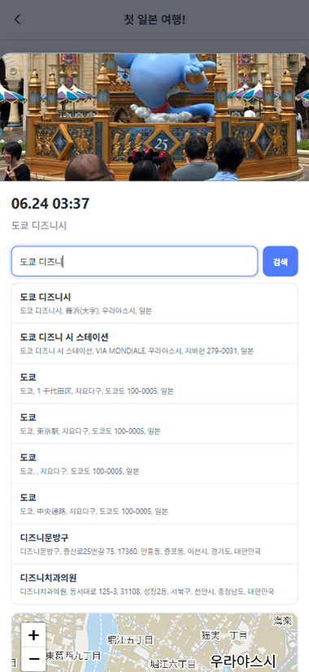
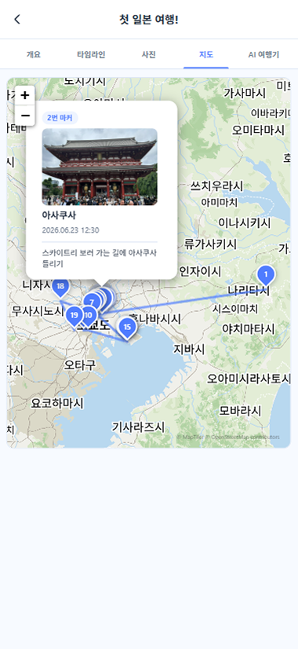

# Travel Story

사진의 촬영 시간과 위치 정보를 기반으로 여행 기록을 타임라인과 지도 형태로 구성하고,  
동행자를 초대해 함께 여행의 순간을 기록하고 공유할 수 있는 여행 기록 웹 서비스입니다.

사진에 포함된 촬영 시간과 위치 정보를 활용해 여행 과정을 자동으로 정리하며,  
위치 정보가 없거나 잘못된 사진은 장소 검색 또는 지도에서 직접 수정할 수 있습니다.

> PC와 모바일 브라우저에서 모두 이용할 수 있습니다.  
> 사진 촬영 후 바로 업로드하거나 현재 위치 기능을 활용하는 경우에는 모바일 환경에서 사용하는 것을 권장합니다.

이 저장소는 **Travel Story의 Frontend 프로젝트**입니다.

---

## Repository

- **Frontend:** https://github.com/ShinWonJin01/travel-story-frontend
- **Backend:** https://github.com/ShinWonJin01/travel-story-backend

## Live Demo

- **Service:** https://travelstory-sgcp.onrender.com

---

## Screenshots

### Home

최근 여행과 초대 현황을 확인하고 새로운 여행을 생성할 수 있습니다.



### Timeline

사진의 촬영 시간을 기준으로 여행 기록을 시간순으로 구성하고,  
날짜별 사진과 메모를 타임라인 형태로 확인할 수 있습니다.



### Photo / Location

사진의 촬영 정보와 메모를 확인하고,  
장소 검색 또는 지도 클릭을 통해 사진 위치를 수정할 수 있습니다.



### Travel Map

위치 정보가 있는 사진을 촬영 순서에 따라 지도에 표시하고,  
사진 위치를 연결하여 여행 이동 경로를 확인할 수 있습니다.



### AI Travel Diary

여행 사진의 장소, 촬영 시간, 메모 정보를 기반으로  
AI 여행기를 생성하고 다시 생성할 수 있습니다.


---

## Tech Stack

### Frontend

- Vue 3
- TypeScript
- Vite
- Vue Router
- Pinia
- Fetch API

### Map / Location

- Leaflet
- MapTiler
- MapTiler Geocoding API
- Kakao Local API
- Geolocation API

### Tool

- Git / GitHub
- VS Code

---

## Main Features

### User

- 회원가입 및 로그인
- 로그인 상태에 따른 화면 및 기능 제어
- 마이페이지 및 프로필 관리
- 비밀번호 변경 및 계정 관리
- 초대 알림 설정

### Trip

- 여행 생성·조회·수정·삭제
- 최근 여행 조회
- 여행 참여자 관리
- 여행 참여자 초대
- 받은 초대 및 보낸 초대 관리
- 초대 수락·거절·취소

### Photo

- 여행 사진 업로드 및 조회
- 사진 촬영 시간 정보 활용
- 사진 위치 정보 표시
- 사진 상세 정보 조회
- 사진 메모 관리
- 장소 검색을 통한 사진 위치 수정
- 지도 클릭을 통한 사진 위치 수정
- 사진 위치 정보 삭제
- 위치 정보가 없는 사진의 현재 위치 적용 지원

### Timeline

- 사진 촬영 시간을 기준으로 여행 사진을 시간순으로 구성
- 날짜별 여행 기록 그룹화
- 사진과 메모를 타임라인 형태로 조회
- 여행 중 기록된 사진의 흐름을 시간순으로 확인

### Map

- 위치 정보가 있는 사진을 지도에 마커로 표시
- 촬영 시간 순으로 번호가 지정된 사진 마커 표시
- 사진 위치를 연결하여 여행 이동 경로 표시
- 마커 선택 시 사진, 촬영 시간, 메모 정보 확인
- MapTiler 기반 커스텀 지도 스타일 적용
- 장소명·주소 검색을 통한 위치 검색
- 검색 결과 선택 시 지도 중심 및 마커 위치 자동 이동
- 지도 클릭을 통한 직접 위치 지정
- 선택한 위치를 사진 정보에 저장
- 국내·해외 장소 검색 지원

### Invitation / Notification

- 여행 참여자 초대
- 받은 초대 및 보낸 초대 조회
- 초대 수락·거절·취소
- 알림 목록 조회
- 알림 읽음 상태 관리
- 읽지 않은 알림 개수 표시
- 최근 활동 내역 조회

### AI Travel Diary

- 여행 사진과 타임라인을 기반으로 AI 여행기 생성
- 사진의 장소, 촬영 시간, 메모 정보를 활용한 여행 기록 생성
- 여행 소유자의 AI 여행기 생성 및 재생성 지원

---

## Project Structure

```text
src
├── api
│   ├── auth.ts              # 인증 및 회원 관련 API
│   ├── geocoding.ts         # Kakao / MapTiler 위치 검색
│   ├── home.ts              # 홈 화면 관련 API
│   ├── http.ts              # 공통 HTTP 요청 처리
│   ├── invitations.ts       # 여행 초대 관련 API
│   ├── notifications.ts     # 알림 관련 API
│   └── trips.ts             # 여행 및 사진 관련 API
│
├── components
│   ├── home                 # 홈 화면 컴포넌트
│   ├── invitations          # 초대 관련 컴포넌트
│   ├── layout               # 공통 레이아웃
│   ├── mypage               # 마이페이지 관련 컴포넌트
│   └── trips
│       ├── create           # 여행 생성
│       └── detail
│           ├── map          # 여행 지도
│           ├── overview     # 여행 개요
│           └── photos       # 여행 사진
│
├── composables              # 공통 Composition 로직
├── stores                   # Pinia 상태 관리
├── router                   # Vue Router 설정
├── views                    # 페이지 단위 View
├── assets                   # 이미지 및 정적 리소스
├── App.vue
└── main.ts
```

화면 단위의 View와 기능 단위의 Component를 분리하고,
재사용 가능한 로직은 Composable과 Store로 분리하여 관리하도록 구성했습니다.

Backend와의 통신 로직은 API 모듈로 분리해
화면 컴포넌트가 API 요청의 세부 구현에 직접 의존하지 않도록 구성했습니다.

---

## Frontend Architecture

```text
View
  ↓
Feature Component
  ↓
Composable / Store
  ↓
API Module
  ↓
Fetch API
  ↓
REST API
  ↓
Spring Boot Backend
```

공통 HTTP 모듈에서 인증 토큰을 포함한 API 요청을 처리하며,
인증이 만료되거나 유효하지 않은 경우 로그인 상태를 정리하고
로그인 화면으로 이동하도록 구성했습니다.

---

## How to Run

### 1. Repository Clone

```bash
git clone https://github.com/ShinWonJin01/travel-story-frontend.git
cd travel-story-frontend
```

### 2. Install Dependencies

```bash
npm install
```

### 3. Environment Variables

프로젝트 루트에 로컬 환경변수 파일을 생성합니다.

예시:

```env
VITE_API_BASE_URL=
VITE_MAPTILER_API_KEY=YOUR_MAPTILER_API_KEY
```

기본 개발 환경에서는 `VITE_API_BASE_URL`을 비워두면
Vite Proxy를 통해 `/api` 요청을 Backend의 `http://localhost:8080`으로 전달합니다.

MapTiler 지도 및 위치 검색 기능을 사용하려면
`VITE_MAPTILER_API_KEY` 설정이 필요합니다.

> API Key가 포함된 환경변수 파일은 Git에 커밋하지 않습니다.

### 4. Run Backend

Frontend 기능을 정상적으로 사용하려면
Travel Story Backend 서버가 함께 실행되어 있어야 합니다.

기본 개발 환경:

```text
http://localhost:8080
```

### 5. Run Frontend

```bash
npm run dev
```

기본 개발 환경에서는 다음 주소로 접속합니다.

```text
http://localhost:5173
```

### Optional Check

```bash
npm run type-check
npm run lint
npm run build
```

---

## Backend

Backend는 별도의 Spring Boot 프로젝트로 구성되어 있습니다.

**Backend Repository**

https://github.com/ShinWonJin01/travel-story-backend

Frontend에서는 REST API를 통해 다음 데이터를 Backend와 주고받습니다.

- 회원 및 인증 정보
- 여행 정보
- 여행 참여자
- 여행 사진
- 사진 위치 정보
- 초대
- 알림
- AI 여행기

Kakao Local API를 활용한 국내 장소 검색 또한
Backend의 위치 검색 API를 통해 Frontend에 전달됩니다.

---

## My Role

개인 프로젝트로 기획부터 Frontend와 Backend 구현, 배포까지
전체 웹 서비스 개발을 진행했습니다.

Frontend에서는 다음 기능을 구현했습니다.

- Vue 3와 TypeScript 기반 SPA 구성
- Vue Router 기반 페이지 이동 및 인증 접근 제어
- Pinia를 활용한 상태 관리
- Fetch API 기반 공통 API 요청 모듈 구성
- Spring Boot REST API 연동
- 여행 생성·조회·수정·삭제 화면 구현
- 여행 참여자 및 초대 관리 UI 구현
- 여행 사진 업로드 및 관리 기능 구현
- 사진 촬영 시간을 활용한 여행 타임라인 구현
- Leaflet과 MapTiler를 활용한 여행 지도 구현
- 사진 촬영 시간 순 번호 마커 및 이동 경로 표시
- Kakao Local API와 MapTiler Geocoding API를 활용한 위치 검색 구현
- 장소명·주소 검색을 활용한 사진 위치 수정 기능 구현
- 지도 클릭을 활용한 사진 위치 직접 수정 기능 구현
- 사진 위치 정보 삭제 기능 구현
- 위치 정보가 없는 사진의 현재 위치 적용 흐름 구현
- 알림 및 최근 활동 화면 구현
- 마이페이지 및 프로필 관리 기능 구현
- AI 여행기 생성 화면 구현
- View / Component / Composable / Store / API 모듈 분리를 통한 코드 구조 개선

---

## Troubleshooting

### 1. 지도 한글 표기 및 지도 스타일 문제 개선

#### Problem

초기에는 Leaflet과 OpenStreetMap 기반 지도를 사용했습니다.

하지만 지도에 표시되는 지역명과 장소명의 언어를
Frontend에서 원하는 방식으로 제어하기 어려웠고,
프로젝트 전체 디자인과 지도 스타일을 통일하는 데에도 한계가 있었습니다.

#### Cause

기존에 사용하던 지도 타일은 지도 이미지에 장소명이 포함되어 제공되는 방식이기 때문에,
Frontend에서 지도에 표시되는 언어와 스타일을 세부적으로 제어하기 어려웠습니다.

#### Solution

Leaflet은 유지하면서 지도 데이터를 MapTiler 기반으로 변경했습니다.

MapTiler의 커스텀 지도 스타일을 적용하고
여행 지도와 사진 위치 수정 지도에 동일한 지도 구성을 적용하여
지도 표현 방식을 통일했습니다.

#### Result

지도 라이브러리인 Leaflet의 기존 기능을 유지하면서도
프로젝트에 맞는 지도 스타일과 장소 표기를 사용할 수 있게 되었으며,
여행 지도와 사진 위치 수정 화면의 지도 UI도 일관되게 구성할 수 있었습니다.

---

### 2. 국내·해외 장소 검색 범위 개선

#### Problem

사진 위치를 수정하기 위해 장소 검색 기능을 구현했지만,
하나의 위치 검색 서비스만으로는 국내와 해외 장소를 모두 안정적으로 검색하기 어려웠습니다.

Kakao Local API는 국내 장소 검색에는 강점이 있지만
해외 여행 장소 검색에는 한계가 있었습니다.

#### Cause

Travel Story는 국내 여행뿐 아니라 해외 여행 기록도 저장할 수 있기 때문에
국내 장소 검색에 최적화된 API만 사용하는 것으로는 서비스 범위를 충분히 지원하기 어려웠습니다.

#### Solution

국내 장소 검색에는 Kakao Local API를 사용하고,
해외를 포함한 추가 위치 검색에는 MapTiler Geocoding API를 사용하도록 구성했습니다.

두 검색 요청을 함께 실행한 뒤 검색 결과를 하나의 형식으로 변환하여 병합하고,
중복되는 장소를 제거한 뒤 사용자에게 보여주도록 구현했습니다.

또한 한쪽 위치 검색 API 요청이 실패하더라도
다른 검색 결과를 사용할 수 있도록 처리했습니다.

#### Result

국내 장소 검색의 정확성을 유지하면서
해외 지역과 장소까지 검색할 수 있게 되어
여행 범위에 관계없이 사진 위치를 수정할 수 있도록 개선했습니다.

---

### 3. 지도 클릭 방식의 사진 위치 수정 정확도 개선

#### Problem

사진의 위치 정보가 없거나 잘못된 경우
사용자가 지도에서 직접 위치를 클릭하여 수정할 수 있도록 구현했습니다.

하지만 정확한 위치를 찾으려면 사용자가 지도를 직접 확대해야 했으며,
원하는 장소와 실제 선택 좌표 사이에 차이가 발생할 수 있었습니다.

#### Cause

지도 좌표를 직접 선택하는 방식만으로는
사용자가 알고 있는 장소명이나 주소를 기준으로 위치를 찾기 어려웠습니다.

#### Solution

장소명 또는 주소를 입력해 위치를 검색할 수 있는 기능을 추가했습니다.

검색 결과에서 원하는 장소를 선택하면
지도 중심과 마커가 해당 위치로 이동하도록 구현하고,
선택한 위도·경도와 장소명을 사진 정보에 저장하도록
Frontend와 Backend API를 연결했습니다.

기존의 지도 직접 클릭 방식도 함께 유지하여
검색 결과에 없는 장소는 사용자가 직접 위치를 지정할 수 있도록 했습니다.

#### Result

사용자가 지도를 반복해서 확대하며 좌표를 찾지 않아도
장소 검색을 통해 보다 정확하게 사진 위치를 수정할 수 있게 되었습니다.

---

### 4. 잘못 저장된 사진 위치 정보 삭제 기능 추가

#### Problem

사진 위치를 다른 장소로 수정할 수는 있었지만,
위치 정보 자체가 잘못된 경우에도 기존 위치를 완전히 제거할 방법이 필요했습니다.

#### Solution

사진 상세 화면에 위치 삭제 기능을 추가하고,
삭제 전 사용자 확인 절차를 거친 뒤
저장된 위치 정보를 제거할 수 있도록 구현했습니다.

#### Result

위치를 다른 장소로 변경하는 것뿐 아니라
위치 정보를 삭제한 뒤 필요한 경우 다시 설정할 수 있어
사진 위치 관리의 유연성을 높였습니다.

---

### 5. 위치 정보가 없는 사진의 현재 위치 처리

#### Problem

모바일에서 촬영한 사진이라도
기기 설정이나 사진 저장 방식에 따라 위치 정보가 포함되지 않을 수 있었습니다.

또한 브라우저의 현재 위치 기능은
접속 환경과 위치 권한에 따라 사용할 수 없거나
정확도가 낮은 좌표를 반환할 수 있었습니다.

#### Solution

업로드한 사진에 위치 정보가 없는 경우
사용자에게 현재 위치 사용 여부를 확인하도록 구성했습니다.

사용자가 동의한 경우 Geolocation API를 통해 현재 위치를 요청하고,
위치 정확도가 일정 기준을 만족하는 경우에만 사진 위치로 사용하도록 처리했습니다.

현재 위치를 가져오지 못하거나
브라우저에서 위치 기능을 사용할 수 없는 경우에도
사진 업로드 자체는 중단하지 않고 위치 정보 없이 등록하도록 했습니다.

등록 이후에는 장소 검색 또는 지도 클릭을 통해
사진 위치를 직접 설정할 수 있습니다.

#### Result

위치 권한이나 브라우저 환경 때문에
사진 업로드 기능 전체가 실패하지 않도록 처리했으며,
위치 정보가 없는 사진도 이후에 사용자가 직접 보완할 수 있도록 구성했습니다.

---

## Note

지도와 장소 검색 기능은 외부 지도·위치 API를 사용합니다.

MapTiler API Key가 설정되지 않은 환경에서는
지도 또는 MapTiler 기반 위치 검색 기능이 정상적으로 동작하지 않을 수 있습니다.

Kakao Local API 기반 검색은 Backend API를 통해 처리되므로
Backend의 Kakao API 관련 설정도 필요합니다.

브라우저의 현재 위치 기능은 보안 정책에 따라
HTTPS와 같은 Secure Context가 요구될 수 있으며,
접속 환경이나 위치 권한에 따라 사용할 수 없을 수 있습니다.

현재 위치를 사용할 수 없는 경우에도
사진은 위치 정보 없이 등록할 수 있으며,
이후 장소 검색 또는 지도에서 직접 위치를 수정할 수 있습니다.

API Key와 같은 민감한 값은 저장소에 직접 커밋하지 않고
환경변수로 관리합니다.
